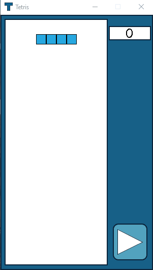

# Tetris
My Python Tetris game using Pygame.

## Setup
The project works immediately out of the box by executing the main.py file.

## Usage

<ul>
<li>static folder contains all of the custom graphics for the project.</li>  
<li>game_board.py contains the class GameBoard for keeping track of the status (filled/empty) of each cell in the game.</li>    
<li>piece.py contains the class Piece for constructing and rotating different pieces.</li>  
<li>main.py's class TetrisMain handles the Pygame window, drawing on the window, and handling the user's input.</li>  
</ul>

## Customize

<strong>game_board.py</strong><ul>
  <li>
   Although the static frame .png around the game board cannot be resized, the game board itself can. By tweaking the display_width
   and display_height variables in the GameBoard class, you can completely customize the dimensions of the game.</li>
  <li>
   If you would like to change the dimensions of the static frame around the Tetris board, you can correctly place the board within
   the desired play area by setting the x_offset and y_offset variables in the GameBoard class. The x_offset should be how far from
   the left edge of the game window you would like the play area to begin and the y_offset should be how far down from the top of 
   the game window you would like the play area to begin.</li>
</ul>
   
<strong>piece.py</strong><ul>
  <li>
   Within the initialize_shape method of the class Piece, you can easily create your own unique blocks to use in the game.
  </li>
</ul>
	
## Contact
If you have any questions about this project, please email me at dylkinder@gmail.com.

Enjoy!
